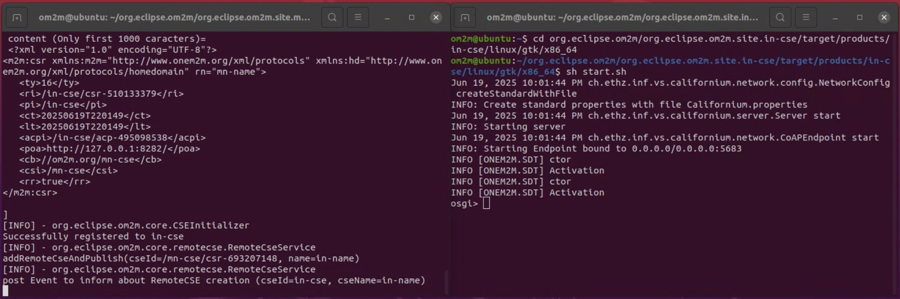
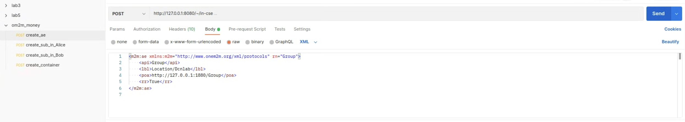
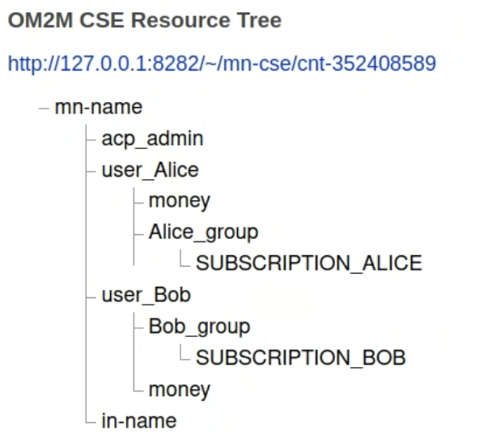
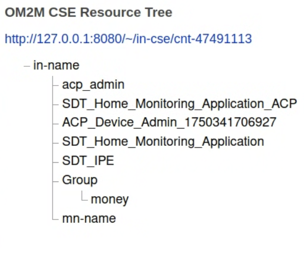

# om2m_budgeting_APP

## Introduction
"This user-friendly budgeting application aims to cultivate consistent financial tracking habits, minimizing the time commitment often associated with complex accounting apps and ensuring that managing finances does not impede one's enjoyment of life."

## Usage
### 1. Open your Om2m MN-CSE and IN-CSE
MN-CSE
```
cd org.eclipse.om2m/org.eclipse.om2m.site.mn-cse/target/products/mn-cse/linux/gtk/x86_64
```

```
sh start.sh
```
IN-CSE
```
cd org.eclipse.om2m/org.eclipse.om2m.site.in-cse/target/products/in-cse/linux/gtk/x86_64
```

```
sh start.sh
```
It would like the screen below:


### 2. Node-Red

You need to download **node red** before type the command
```
node-red
```

After that, you can connect the link: **http://localhost:1880**

Use flow.json to build the budgeting app's environment setup tool on node-red.

Click three bottons to build Alice's AE and container on MN-CSE:


Click three bottons to build Bob's AE and container on MN-CSE:


Build up successfully:


### 3. Postman
Next, we need to use Postman to establish the subscription relationship between the MN and the IN. This will allow data received by the MN to be smoothly transmitted to the IN. Please use `/om2m_money.postman_collection.json`

Send all the **post** (four in total) in **om2m_money** folder:


After that:

<div style="display: flex; justify-content: center;">
  
  
</div>

### 4. APP


